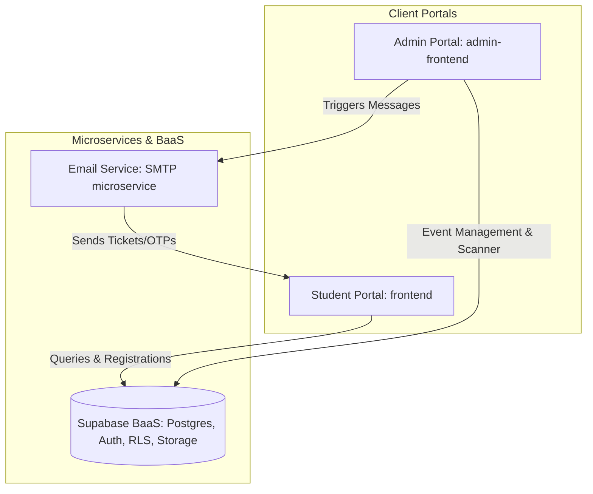

# SERAS — Smart Event Registration & Attendance System

SERAS is a modern, full-stack, concurrent college event registration and attendance tracking system. It provides a seamless interface for students to discover and register for events, and empowers faculty and admins with advanced analytics, QR-based check-ins, and direct participant communication.

---

## 🏗️ Architecture Overview

SERAS is built as a monorepo containing frontends, a backend database schema, and an email microservice.



---

## ✨ Features

### 🎓 Student / Participant Portal (`frontend`)
*   **Event Exploration:** Sleek grid displaying active, upcoming, and featured college events.
*   **Quick Registration:** Seamless sign-up form with input validation.
*   **Dynamic Tickets:** Automatic generation of a ticket containing a unique registration QR code.
*   **Virtual Assistant (HelperAI):** Real-time interactive AI chatbot to assist students with event schedules, guides, and FAQs.
*   **Certificate & Feedback:** Retrieve participation certificates and submit event feedback.

### 🛡️ Admin & Faculty Portal (`admin-frontend`)
*   **Analytics Dashboard:** Visual insights showing live event registrations, ticket validation status, and attendance statistics.
*   **QR Scanner Attendance:** Integrated camera-based scanner to instantly scan and check-in students at the venue.
*   **Event Management:** Complete CRUD capabilities to create, schedule, edit, and categorize events.
*   **Messaging System:** Live chat workspace for organizers to communicate directly with registered students.
*   **Auditing Logs:** Database-level activity logging showing all event creation, registration changes, and admin logs.

### 📧 Email Microservice (`email-service`)
*   A standalone Express.js microservice configured to dispatch transactional emails (like registrations, tickets, and OTP codes) securely using SMTP.

---

## 🛠️ Technology Stack

*   **Frontends:** React 19 (TypeScript), Vite, TailwindCSS, Framer Motion (for premium animations), and shadcn/ui.
*   **Database & Auth:** Supabase (PostgreSQL with Row Level Security (RLS) policies).
*   **Microservice:** Node.js, Express, Nodemailer.
*   **Deployment:** Vercel (Client side) and Supabase Cloud (Database/migrations).

---

## 🚀 Local Setup & Installation

Follow these steps to run the entire project locally on your machine:

### Prerequisite: Install dependencies
Install the required packages in all sub-projects from the root directory:
```bash
npm install --prefix email-service
npm install --prefix frontend
npm install --prefix admin-frontend
```

### 1. Database Setup (Supabase)
Ensure you have the Supabase CLI installed, link your project, and push the latest migrations:
```bash
cd backend
npx supabase login
npx supabase db push
```

### 2. Configure Environment Variables
Create `.env.local` files inside the directories with the correct keys:

*   **`frontend/` and `admin-frontend/`:**
    ```env
    VITE_SUPABASE_URL=https://your-project.supabase.co
    VITE_SUPABASE_ANON_KEY=your-anonymous-key
    ```
*   **`email-service/`:**
    ```env
    PORT=5000
    SMTP_HOST=smtp.your-provider.com
    SMTP_PORT=587
    SMTP_USER=your-email@domain.com
    SMTP_PASS=your-password
    ```

### 3. Run Development Servers
Start all services (Student Frontend, Admin Frontend, and Email Service) concurrently with a single command from the root directory:
```bash
npm run dev
```
*   Student Portal runs on: `http://localhost:5173`
*   Admin Portal runs on: `http://localhost:5174` (or next available port)
*   Email Service runs on: `http://localhost:5000`

---

## 🌐 Deployment

### Frontend (Vercel)
The project is configured for Vercel deployment. To push to production:
```bash
npx vercel --prod
```
*   Production Link: **[https://chargemate-sigma.vercel.app](https://chargemate-sigma.vercel.app)**
*   Deployments History: **[Vercel Dashboard](https://vercel.com/balas-projects-f94ffc11/chargemate/deployments)**
